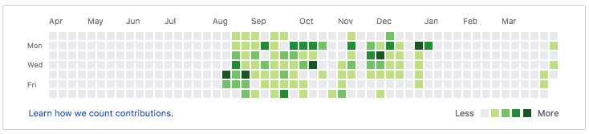

## Interruptions

Do you ever get interrupted in the middle of your flow?  I mean, like, *really* interrupted?  

Let me explain.  

My wife and I finally got on the same page, and we decided to sell our house.  This happened about New Year’s Eve last year.  So that meant all my free time for coding and learning was gone as now the priority was to declutter and paint the house.

We listed the house January 30 and we had an open house on February 2.  We went under contract a few days later.  That buyer flaked and we got another buyer on the hook.  We finally closed with them on March 11.  

All of this and we had no plan for where to live next.  So, now we are living in rural Idaho with my sister-in-law and her husband suffering through a 6 Mbps connection.  Thanks Ajit Pai…

This is what my Github profile looks like right now:

See that big gap?  Yeah, that was spent fixing all the little things, cleaning, decluttering and moving out of our house.  I have just recently gotten settled enough and have my (mostly) own space where I can sit at my laptop and catch up with all my projects again. 

## Projects

Speaking of projects, I am making a website for my sister-in-law and her herb shop using webflow.com  Webflow is powerful and easy to use so you can produce results and not just bang your head on the keyboard.  The only thing I would improve is linking this to Github somehow so I can get my green squares…

Expect more from me soon as I continue to get up speed and back into coding.

--Nate
